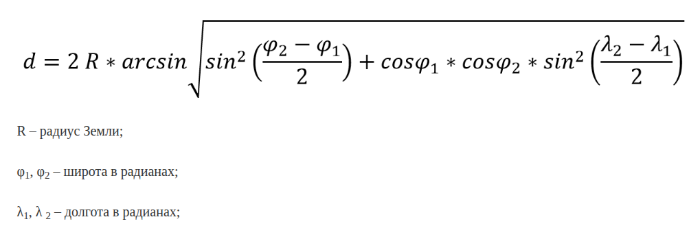

## Лабораторная работа №2. Хитрый запрос

Выполнил Лепа Дмитрий

Рассматриваемая база данных: [тык](https://edu.postgrespro.ru/demo-small.zip)

### 🐡 Задание(вариант 4)

Исследуйте соотношение цены и дальности полета для различных типов самолетов и классов обслуживания. Рассчитайте стоимость за километр полета для каждой комбинации модели самолета и класса. 

Определите наиболее экономичные варианты для пассажиров, а также наиболее выгодные комбинации для авиакомпании с точки зрения выручки.

### Решение
#### 1. Гаверсинусы💀
Первое(и самое сложное) - нужно уметь вычислять расстояние, пройденное самолётом, зная рейс(`flight_id`). В таблице `flights` у нас есть `departure_airport` и `arrival_airport`, а из таблицы `airports` мы сможем достать координаты каждого аэропорта. 

**Вопрос:** Как вычислить расстояние между двумя точками на земном шаре?  

**Ответ:** Я нашёл формулу [гаверсинусов](https://en.wikipedia.org/wiki/Haversine_formula):



**Замечание:** На практике вместо взятия арксинуса чаще используют atan2, исходя из следующих соображений:
1. atan2(x, y) более точный с точки зрения компьютера(вычислять легче)
2. atan2(x, y) знает, в какой четверти расположен вектор (x, y)

Теперь, чтобы наш запрос не был сильно громоздким и непонятным, напишем функцию вычисления расстояния между городами отдельно, на языке plpgsql

```sql
CREATE OR REPLACE FUNCTION distance_km(
    lon1 DOUBLE PRECISION, 
    lat1 DOUBLE PRECISION, 
    lon2 DOUBLE PRECISION,
    lat2 DOUBLE PRECISION)
RETURNS DOUBLE PRECISION AS $$
DECLARE
    a DOUBLE PRECISION;
    c DOUBLE PRECISION;
BEGIN
    a := sin(radians(lat2 - lat1)/2)^2 +
         cos(radians(lat1)) * cos(radians(lat2)) *
         sin(radians(lon2 - lon1)/2)^2;
    c := 2 * atan2(sqrt(a), sqrt(1 - a));
    RETURN 6371 * c;
END;
$$ LANGUAGE plpgsql;
```

**Пояснение:**
- `CREATE OR REPLACE FUNCTION name(args)` - создание(или замена, если уже существует) функции с названием name, которая принимает аргументы args. В объявлении аргументов указывается их тип
- `RETURNS type AS $$` - указывается тип возвращаемого значения и начинается описание функции после символов &&
- `DECLARE` - блок объявления переменных
- `BEGIN, END` - блок, в котором находится код непосредственно самой функции
- `a := expression` - присваивание переменное некоторого значения
- `sin(x), cos(x), atan2(x, y), radians(x)` - встроенные в язык plpgsql тригонометрические функции
- `$$ LANGUAGE plpgsql` - конец описания функции и указание языка программирования, в данном случае - plpgsql

NB: [plpgsql](https://postgrespro.ru/docs/postgresql/current/plpgsql) - Procedural Language PostgreSQL

Исследуйте соотношение цены и дальности полета для различных типов самолетов и классов обслуживания. Рассчитайте стоимость за километр полета для каждой комбинации модели самолета и класса. Определите наиболее экономичные варианты для пассажиров, а также наиболее выгодные комбинации для авиакомпании с точки зрения выручки.

#### 2. Сам запрос
Разберём задачу пошагово.
Какие таблицы нам вообще нужны?
1. `ticket_flights` - для доступа к классам обслуживания и стоимости билетов 
2. `flights` - "соединительная таблица", по которой мы сможем найти аэропорты вылета и прибытия, вида самолёта, и тд
3. `aircrafts` - для получения типа самолёта по его коду
4. `airports` - для получения координат аэропортов по их кодам

**Идея:** Нам нужно вычислить для каждого самолёта и класса какое-то значение, значит группировку будем проводить по модели и классу обслуживания.

Для каждого рейса найдём координаты вылета, прибытия, а уже по координатам вычислим расстояние(при помощи введённой ране функции). 

Значения этих расстояний просуммируем агрегатной функцией `SUM()`.

Аналогично просуммируем стоимости билетов всех рейсов

Разделим второе на первое и получим стоимость пролёта одного километра

```sql
SELECT
    ac.model,
    tf.fare_conditions AS class,
    SUM(tf.amount) AS total_price,
    ROUND(
        SUM(distance_km(a_from.coordinates[0], a_from.coordinates[1], a_to.coordinates[0], a_to.coordinates[1]))::numeric,
        2) AS total_distance,
    ROUND(
        SUM(tf.amount) / 
        SUM(distance_km(a_from.coordinates[0], a_from.coordinates[1], a_to.coordinates[0], a_to.coordinates[1]))::numeric,
        2) AS cost_per_km
FROM ticket_flights tf
JOIN flights f ON f.flight_id = tf.flight_id
JOIN aircrafts ac ON f.aircraft_code = ac.aircraft_code
JOIN airports a_from ON f.departure_airport = a_from.airport_code
JOIN airports a_to ON f.arrival_airport = a_to.airport_code
GROUP BY model, class
ORDER BY cost_per_km ASC;
```
**Нюансы:** 
- `ROUND(SUM(..)::numeric, 2)` - округление числа до двух знаков после запятой. Использовал здесь явное приведение к типу `NUMERIC`, потому что иначе `SUM()` возвращает тип `DOUBLE PRECISION`, который нельзя округлять(приколы постгреса, я не знаю)
- `JOIN table ON` - объединение таблицы по ключам
- `ORDER BY column ASC` - сортировка строк по атрибуту `column` в возрастающем(ascending) порядке

### Вывод
После выполнения запроса получим примерно такую таблицу:
```
        model        |  class   |  total_price  | total_distance | cost_per_km 
---------------------+----------+---------------+----------------+-------------
 Сессна 208 Караван  | Economy  |   96373800.00 |     9621918.65 |       10.02
 Аэробус A319-100    | Economy  | 1677962800.00 |   167057093.32 |       10.04
 Боинг 777-300       | Economy  | 2239852200.00 |   223141853.80 |       10.04
 Боинг 767-300       | Economy  | 2979484900.00 |   296633572.93 |       10.04
 Боинг 737-300       | Economy  | 1092590000.00 |   108663662.67 |       10.05
 Сухой Суперджет-100 | Economy  | 3593634000.00 |   357347668.70 |       10.06
 Бомбардье CRJ-200   | Economy  | 1982760500.00 |   196830168.23 |       10.07
 Аэробус A321-200    | Economy  | 1033026200.00 |   102242076.61 |       10.10
 Боинг 777-300       | Comfort  |  566116900.00 |    33298149.22 |       17.00
 Боинг 777-300       | Business |  625236400.00 |    20845388.02 |       29.99
 Сухой Суперджет-100 | Business | 1520850700.00 |    50706930.57 |       29.99
 Боинг 767-300       | Business | 1391792200.00 |    46396457.78 |       30.00
 Аэробус A319-100    | Business | 1028200300.00 |    34270187.82 |       30.00
 Аэробус A321-200    | Business |  605137900.00 |    20163000.20 |       30.01
 Боинг 737-300       | Business |  333962100.00 |    11128469.68 |       30.01
(15 rows)
```
Если мы хотим явно увидеть самый дешёвый самолёт и класс с точки зрения "стоимость одного километра", то в конец запроса можно добавить `LIMIT 1`, что означает, что мы хотим вывести только первую строчку. В нашем примере самый дешёвый класс обслуживания - `Эконом` в самолёте `Сессна 208 Караван`. Если мы хоти выбрать самую дорогую комбинацию `model & class`, то стоит обратиться к последней строчке и увидеть там класс `Бизнес` в модели `Боинг 737-300`. Если бы записей было много, то удобнее записать сортировку в убывающем порядке(`ASC` заменить на `DESC`) и так же написать `LIMIT 1`.
**Ответ:**
- Самый выгодный для пассажира вариант - класс `Эконом` в самолёте `Сессна 208 Караван`
- Самый выгодный для авиакомпании вариант - класс `Бизнес` в самолёте `Боинг 737-300`
